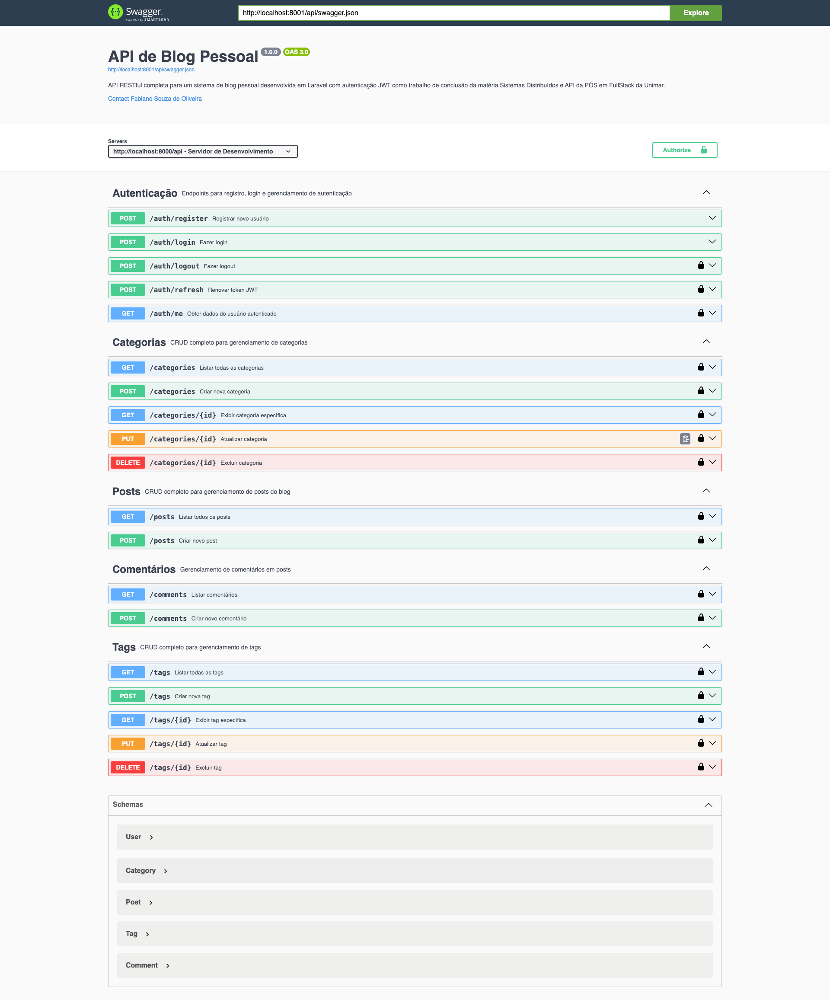

# 📝 API de Blog Pessoal

**Sistema de Blog Pessoal desenvolvido em Laravel com Autenticação JWT**

---

## 🎓 Informações Acadêmicas

**Pós-graduação FullStack Unimar**  
**Projeto Final da Disciplina de Desenvolvimento Distribuído e API**

- **Autor:** Fabiano Souza de Oliveira
- **Professor:** Matheus Santos - <matheussantos@unimar.br>
- **Entregar até:** 01/11/2025

---

## 📋 Sobre o Projeto

Esta é uma **API RESTful completa** para um sistema de blog pessoal, desenvolvida como trabalho de conclusão da matéria **Sistemas Distribuídos e API** da Pós-graduação FullStack da Unimar.

### 🎯 Funcionalidades Principais

- ✅ **Autenticação JWT** completa (login, registro, logout, refresh)
- ✅ **CRUD de Categorias** (criar, listar, exibir, editar, excluir)
- ✅ **CRUD de Posts** (criar, listar, exibir, editar, excluir) com relacionamento N:N com tags
- ✅ **CRUD de Tags** (criar, listar, exibir, editar, excluir)
- ✅ **Sistema de Comentários** com notificação automática por email
- ✅ **Jobs/Queue** para processamento em segundo plano
- ✅ **Documentação Swagger** completa e interativa

### 🏗️ Arquitetura

O projeto segue rigorosamente o padrão de arquitetura:
**Request → Controller → Service → Repository → Resource**

### 📊 Modelagem de Dados

- **User** (Usuários do sistema)
- **Category** (Categorias dos posts)
- **Post** (Posts do blog)
- **Tag** (Tags dos posts)
- **Comment** (Comentários nos posts)
- **post_tag** (Tabela pivô para relacionamento N:N)

---

## 🚀 Instalação e Configuração

### 📋 Pré-requisitos

- PHP 8.2+
- Composer
- MySQL 8.0+
- Node.js (opcional, para assets)

### 1️⃣ Clone o Repositório

```bash
git clone <url-do-repositorio>
cd api-blog-pessoal
```

### 2️⃣ Instale as Dependências

```bash
composer install
```

### 3️⃣ Configure o Ambiente

```bash
# Copie o arquivo de ambiente
cp .env.example .env

# Gere a chave da aplicação
php artisan key:generate

# Gere a chave JWT
php artisan jwt:secret
```

### 4️⃣ Configure o Banco de Dados

Edite o arquivo `.env` com suas credenciais:

```env
DB_CONNECTION=mysql
DB_HOST=127.0.0.1
DB_PORT=3306
DB_DATABASE=blog_pessoal
DB_USERNAME=seu_usuario
DB_PASSWORD=sua_senha

# Configuração JWT
JWT_SECRET=sua_chave_jwt_gerada

# Configuração de Queue
QUEUE_CONNECTION=database
```

### 5️⃣ Execute as Migrations

```bash
# Criar as tabelas
php artisan migrate

# Criar tabela de jobs (para queue)
php artisan queue:table
php artisan migrate
```

### 6️⃣ Popule o Banco com Dados de Teste

```bash
# Execute os seeders
php artisan db:seed

# Ou execute seeders específicos
php artisan db:seed --class=UserSeeder
php artisan db:seed --class=CategorySeeder
php artisan db:seed --class=TagSeeder
php artisan db:seed --class=PostSeeder
php artisan db:seed --class=CommentSeeder
```

### 7️⃣ Inicie o Servidor

```bash
# Servidor da aplicação
php artisan serve

# Worker da queue (em outro terminal)
php artisan queue:work
```

---

## 📚 Documentação da API

### 🌐 Swagger UI

Acesse a documentação interativa em:

```textplain
http://localhost:8000/api/docs
```



### 📄 JSON da Documentação

```textplain
http://localhost:8000/api/swagger.json
```

---

## 🔐 Autenticação

### Credenciais de Teste

```json
{
  "email": "fabiano@blog.com",
  "password": "password"
}
```

```json
{
  "email": "admin@blog.com", 
  "password": "password"
}
```

### Como Usar JWT

1. **Faça login** para obter o token:

    ```bash
    curl -X POST http://localhost:8000/api/auth/login \
    -H "Content-Type: application/json" \
    -d '{"email": "fabiano@blog.com", "password": "password"}'
    ```

2. **Use o token** nos headers das requisições:

    ```bash
    curl -X GET http://localhost:8000/api/posts \
    -H "Authorization: Bearer SEU_TOKEN_JWT"
    ```

---

## 🛠️ Endpoints Principais

### 🔑 Autenticação

- `POST /api/auth/register` - Registrar usuário
- `POST /api/auth/login` - Fazer login
- `POST /api/auth/logout` - Fazer logout
- `POST /api/auth/refresh` - Renovar token
- `GET /api/auth/me` - Dados do usuário

### 📁 Categorias

- `GET /api/categories` - Listar categorias
- `POST /api/categories` - Criar categoria
- `GET /api/categories/{id}` - Exibir categoria
- `PUT /api/categories/{id}` - Atualizar categoria
- `DELETE /api/categories/{id}` - Excluir categoria

### 📝 Posts

- `GET /api/posts` - Listar posts (com filtros)
- `POST /api/posts` - Criar post
- `GET /api/posts/{id}` - Exibir post
- `PUT /api/posts/{id}` - Atualizar post
- `DELETE /api/posts/{id}` - Excluir post

### 🏷️ Tags

- `GET /api/tags` - Listar tags (com opção de tags populares)
- `POST /api/tags` - Criar tag
- `GET /api/tags/{id}` - Exibir tag
- `PUT /api/tags/{id}` - Atualizar tag
- `DELETE /api/tags/{id}` - Excluir tag

### 💬 Comentários

- `GET /api/comments` - Listar comentários
- `POST /api/comments` - Criar comentário (dispara job de notificação)
- `GET /api/comments/{id}` - Exibir comentário
- `PUT /api/comments/{id}` - Atualizar comentário
- `DELETE /api/comments/{id}` - Excluir comentário

---

## ⚙️ Sistema de Jobs/Queue

### 📧 Notificação de Comentários

Quando um usuário comenta em um post, o autor do post recebe uma notificação por email automaticamente através de um **Job processado em segundo plano**.

### Como Funciona

1. **Usuário cria comentário** → `POST /api/comments`
2. **Job é despachado** → `SendCommentNotificationJob`
3. **Job vai para a fila** → Tabela `jobs` no banco
4. **Worker processa** → `php artisan queue:work`
5. **Notificação é enviada** → Log/Email para o autor

### Comandos Úteis

```bash
# Processar jobs da fila
php artisan queue:work

# Monitorar jobs
php artisan queue:monitor

# Ver jobs pendentes
php artisan tinker --execute="echo 'Jobs pendentes: ' . DB::table('jobs')->count();"
```

---

## 🗄️ Estrutura do Banco de Dados

### Relacionamentos Implementados

- **User** 1:N **Post** (Um usuário tem muitos posts)
- **User** 1:N **Comment** (Um usuário tem muitos comentários)
- **Category** 1:N **Post** (Uma categoria tem muitos posts)
- **Post** 1:N **Comment** (Um post tem muitos comentários)
- **Post** N:N **Tag** (Posts e tags - relacionamento muitos para muitos)

### Tabelas Criadas

```sql
-- Usuários (já existe no Laravel)
users (id, name, email, password, timestamps)

-- Categorias
categories (id, name, slug, timestamps)

-- Tags  
tags (id, name, slug, timestamps)

-- Posts
posts (id, user_id, category_id, title, content, published_at, timestamps)

-- Comentários
comments (id, user_id, post_id, body, timestamps)

-- Tabela Pivô (Posts ↔ Tags)
post_tag (post_id, tag_id)

-- Jobs (para queue)
jobs (id, queue, payload, attempts, reserved_at, available_at, created_at)
```

---

## 🧪 Testes

### Testar via Swagger UI

1. Acesse: `http://localhost:8000/api/docs`
2. Faça login para obter token JWT
3. Clique em "Authorize" e insira: `Bearer {seu_token}`
4. Teste todos os endpoints

### Testar via cURL

```bash
# Login
curl -X POST http://localhost:8000/api/auth/login \
  -H "Content-Type: application/json" \
  -d '{"email": "fabiano@blog.com", "password": "password"}'

# Listar posts (com token)
curl -X GET http://localhost:8000/api/posts \
  -H "Authorization: Bearer SEU_TOKEN"

# Criar comentário (dispara job)
curl -X POST http://localhost:8000/api/comments \
  -H "Authorization: Bearer SEU_TOKEN" \
  -H "Content-Type: application/json" \
  -d '{"post_id": 1, "body": "Ótimo post!"}'
```

---

## 📁 Estrutura do Projeto

```textplain
api-blog-pessoal/
├── app/
│   ├── Http/
│   │   ├── Controllers/     # Controllers da API
│   │   ├── Requests/        # Validações de entrada
│   │   └── Resources/       # Formatação de saída
│   ├── Models/              # Models Eloquent
│   ├── Services/            # Lógica de negócio
│   ├── Repositories/        # Acesso aos dados
│   └── Jobs/                # Jobs para processamento assíncrono
├── database/
│   ├── migrations/          # Estrutura do banco
│   └── seeders/             # Dados de teste
├── routes/
│   └── api.php              # Rotas da API
└── public/
    └── swagger.json         # Documentação Swagger
```

---

## 🛡️ Segurança

- ✅ **Autenticação JWT** em todas as rotas protegidas
- ✅ **Validação de dados** em todos os requests
- ✅ **Autorização** (usuários só podem editar seus próprios posts/comentários)
- ✅ **Sanitização** de dados de entrada
- ✅ **Rate limiting** (configurável)

---

## 🚀 Deploy e Produção

### Comandos para Produção

```bash
# Otimizar aplicação
php artisan config:cache
php artisan route:cache
php artisan view:cache

# Executar migrations
php artisan migrate --force

# Processar queue (usar supervisor/systemd)
php artisan queue:work --daemon
```

### Variáveis de Ambiente Importantes

```env
APP_ENV=production
APP_DEBUG=false
QUEUE_CONNECTION=database
JWT_TTL=60
```

---

## 📞 Suporte

Para dúvidas sobre o projeto:

- **Autor:** Fabiano Souza de Oliveira - <fsouzaweb@gmail.com>
- **Professor:** Matheus Santos - <matheussantos@unimar.br>
- **Instituição:** Unimar - Pós-graduação FullStack

---

## 📄 Licença

Este projeto foi desenvolvido para fins acadêmicos como trabalho de conclusão da disciplina de Sistemas Distribuídos e API.

---
